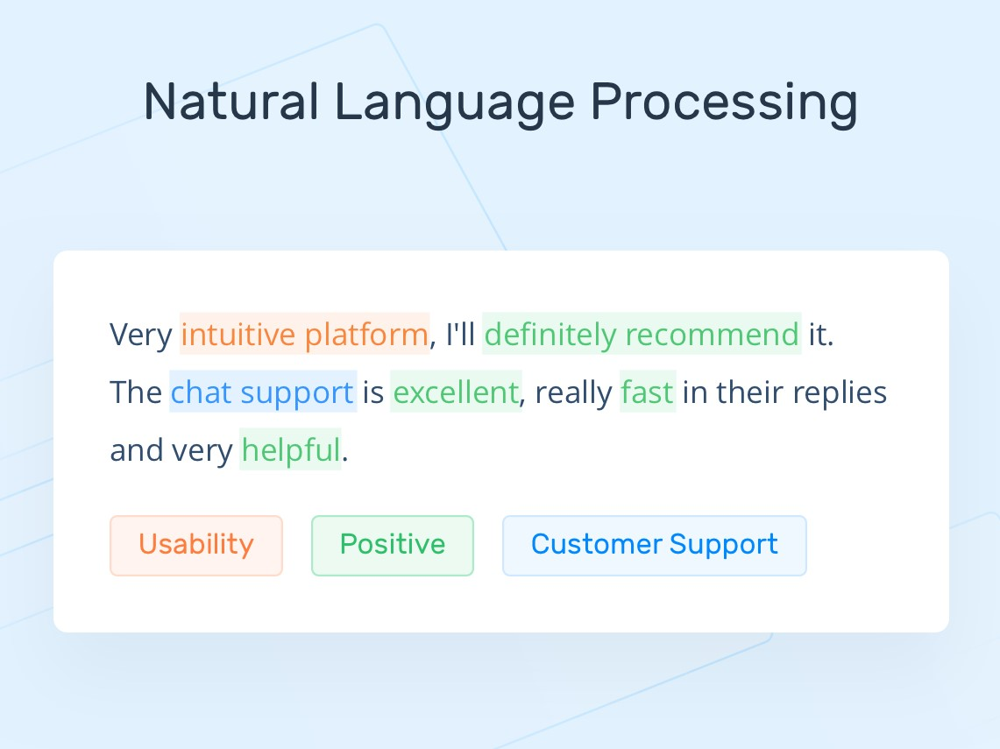

# Natural-Language-Procesing 🌠
_This repository cotains all the codes particulary related to nlp task as I'm trying to learn NLP._

## What is natural language processing? :speech_balloon:

___Natural language processing (NLP) refers to the branch of computer science—and more specifically, the branch of artificial intelligence or AI—concerned with giving computers the ability to understand text and spoken words in much the same way human beings can.___

NLP combines computational linguistics—rule-based modeling of human language—with statistical, machine learning, and deep learning models. Together, these technologies enable computers to process human language in the form of text or voice data and to ‘understand’ its full meaning, complete with the speaker or writer’s intent and sentiment.

NLP drives computer programs that translate text from one language to another, respond to spoken commands, and summarize large volumes of text rapidly—even in real time. There’s a good chance you’ve interacted with NLP in the form of voice-operated GPS systems, digital assistants, speech-to-text dictation software, customer service chatbots, and other consumer conveniences. But NLP also plays a growing role in enterprise solutions that help streamline business operations, increase employee productivity, and simplify mission-critical business processes.

## NLP tasks :books:
Human language is filled with ambiguities that make it incredibly difficult to write software that accurately determines the intended meaning of text or voice data. Homonyms, homophones, sarcasm, idioms, metaphors, grammar and usage exceptions, variations in sentence structure—these just a few of the irregularities of human language that take humans years to learn, but that programmers must teach natural language-driven applications to recognize and understand accurately from the start, if those applications are going to be useful.

Several NLP tasks break down human text and voice data in ways that help the computer make sense of what it's ingesting. Some of these tasks include the following:

- __Speech recognition__, also called speech-to-text, is the task of reliably converting voice data into text data. Speech recognition is required for any application that follows voice commands or answers spoken questions. What makes speech recognition especially challenging is the way people talk—quickly, slurring words together, with varying emphasis and intonation, in different accents, and often using incorrect grammar.
- __Part of speech tagging__, also called grammatical tagging, is the process of determining the part of speech of a particular word or piece of text based on its use and context. Part of speech identifies ‘make’ as a verb in ‘I can make a paper plane,’ and as a noun in ‘What make of car do you own?’
- __Word sense disambiguation__ is the selection of the meaning of a word with multiple meanings  through a process of semantic analysis that determine the word that makes the most sense in the given context. For example, word sense disambiguation helps distinguish the meaning of the verb 'make' in ‘make the grade’ (achieve) vs. ‘make a bet’ (place).
- __Named entity recognition__, or __NEM__, identifies words or phrases as useful entities. NEM identifies ‘Kentucky’ as a location or ‘Fred’ as a man's name.
- __Co-reference resolution__ is the task of identifying if and when two words refer to the same entity. The most common example is determining the person or object to which a certain pronoun refers (e.g., ‘she’ = ‘Mary’),  but it can also involve identifying a metaphor or an idiom in the text  (e.g., an instance in which 'bear' isn't an animal but a large hairy person).
- __Sentiment analysis__ attempts to extract subjective qualities—attitudes, emotions, sarcasm, confusion, suspicion—from text.
- __Natural language generation__ is sometimes described as the opposite of speech recognition or speech-to-text; it's the task of putting structured information into human language.
